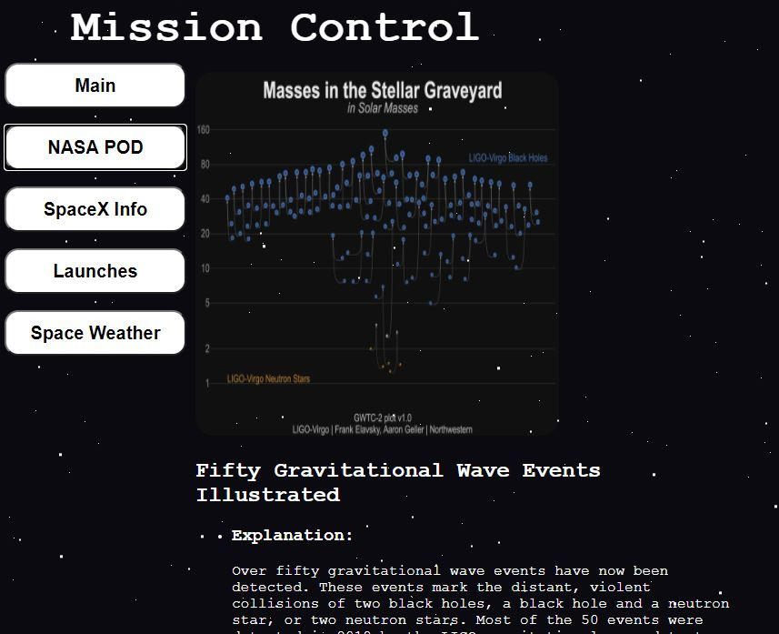
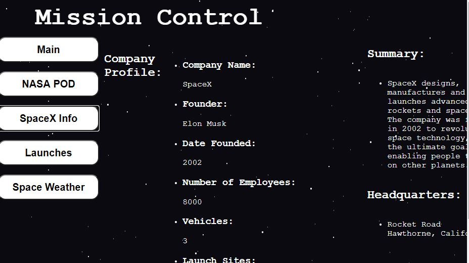
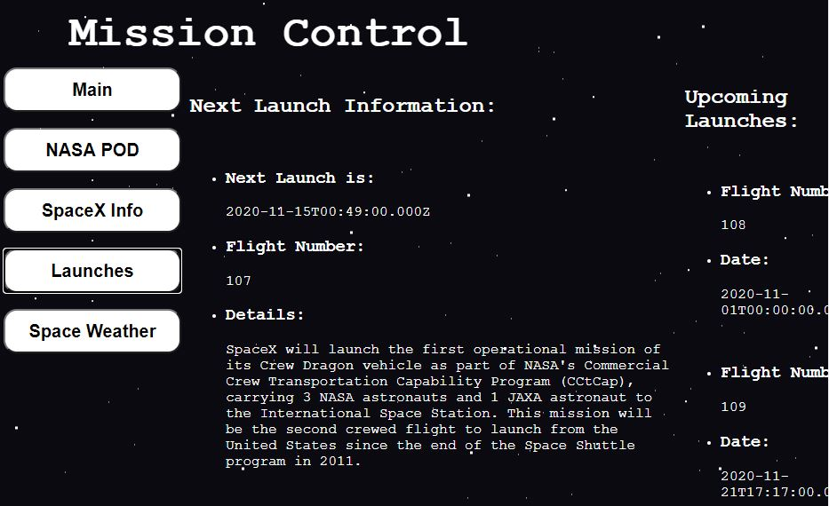
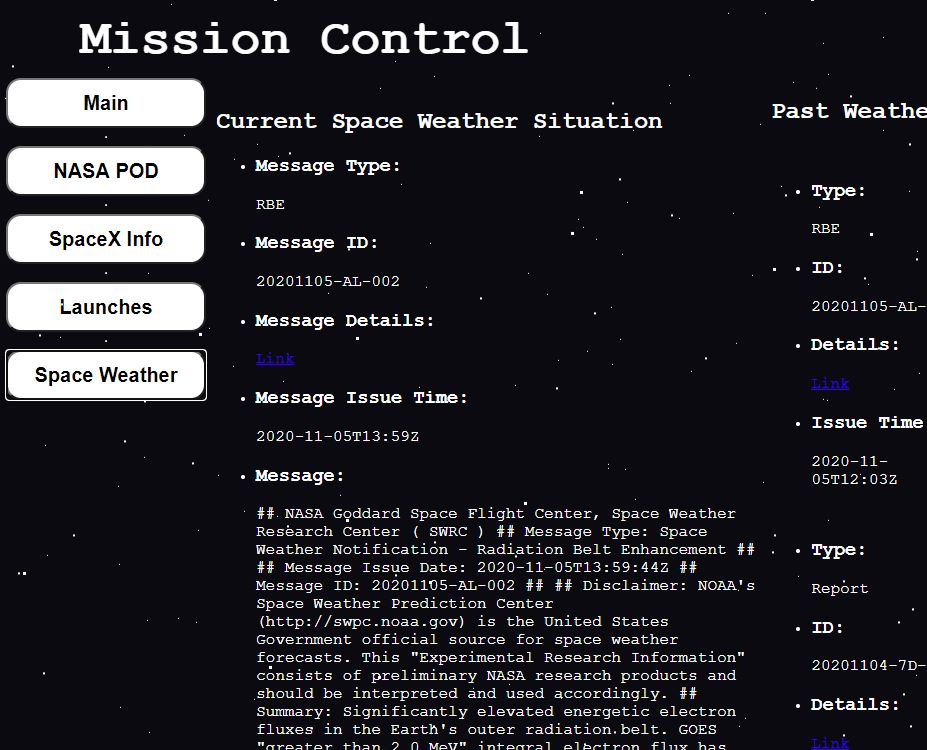

# Mission Control

## Summary:
A website designed to access spaceX information and upcoming launches. Also designed to have a little fun by pulling the NASA
picture of the day with a little information about it. You can also look up the current space weather information and past weather
information.

## Technology Used:
JavaScript was the main language used, however, CSS, and HTML were used as well. The SpaceX API was used to fetch the launch and 
company information. Two different NASA API's were used to obtain the picture of the day and the space weather. All together three 
different API's were used in the creation of this app. Keynote about this app is that it self updates with the API's.

# Link to App
https://philhaynes337.github.io/missioncontrol/

## Screenshots

About Page:

NASA Picture of the Day Page:

SpaceX Information Page:

SpaceX Launch Information Page:

Space Weather Page:

