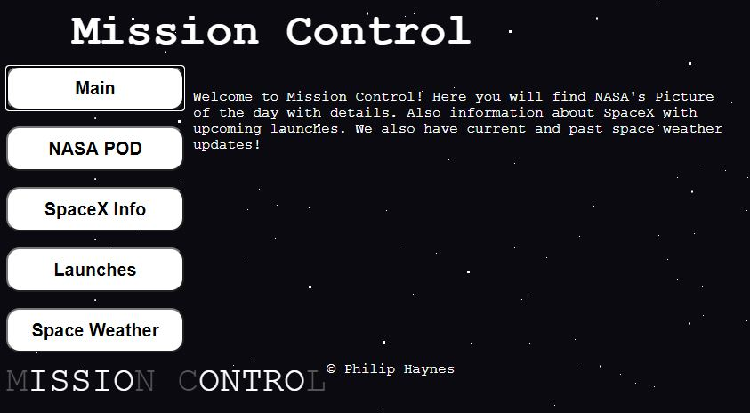

# Mission Control

A website designed to access spaceX information and upcoming launches. Also designed to have a little fun by pulling the NASA
picture of the day with a little information about it. You can also look up the current space weather information and past weather
information.

# Link to App
https://philhaynes337.github.io/missioncontrol/

## Screenshots

About Page:

